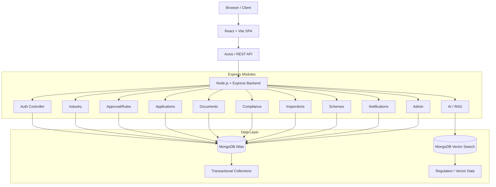
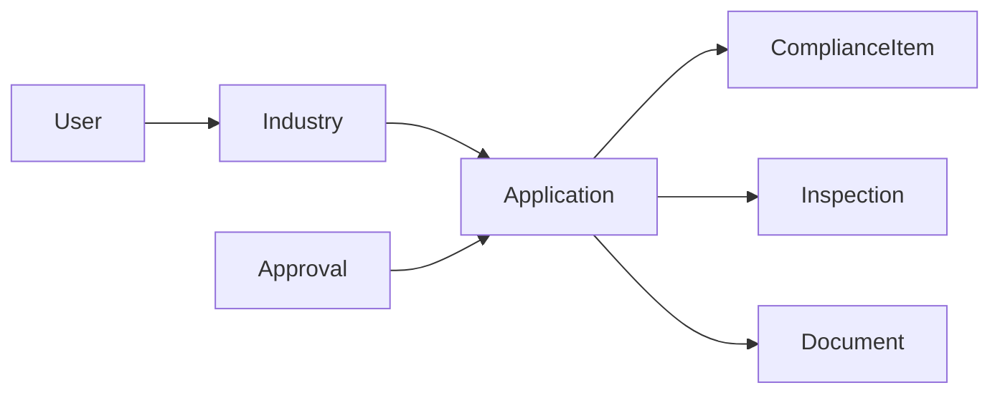
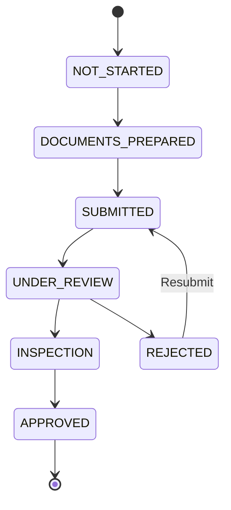
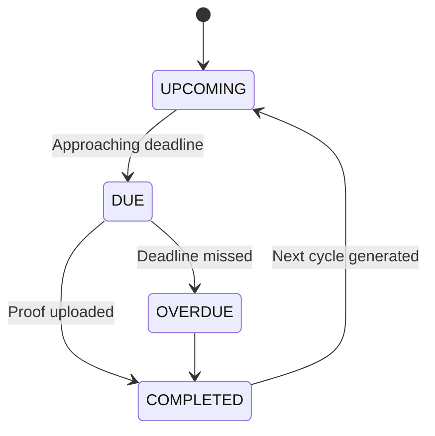

# UdyogSanchar
**Smart Industrial Compliance & Approval Management Platform**

*Smart India Hackathon 2026*  
*Problem Statement SIH26130*


---

## Table of Contents
1. [Live Links](#live-links)
2. [Project Overview](#project-overview)
3. [Problem Statement](#problem-statement)
4. [Proposed Solution](#proposed-solution)
5. [Value Proposition](#value-proposition)
6. [Core Features](#core-features)
7. [User Journey](#user-journey)
8. [System Architecture](#system-architecture)
9. [Tech Stack](#tech-stack)
10. [Frontend Architecture](#frontend-architecture)
11. [Backend Architecture](#backend-architecture)
12. [Database Design](#database-design)
13. [Rule Engine Deep Dive](#rule-engine-deep-dive)
14. [RAG / AI Deep Dive](#rag--ai-deep-dive)
15. [Vector Search State Filter](#vector-search-state-filter)
16. [Document Intelligence](#document-intelligence)
17. [Application State Machine](#application-state-machine)
18. [Compliance State Machine](#compliance-state-machine)
19. [Inspection Workflow](#inspection-workflow)
20. [SLA Tracking](#sla-tracking)
21. [Role-Based Access Control](#role-based-access-control)
22. [Security](#security)
23. [API Documentation](#api-documentation)
24. [Environment Variables](#environment-variables)
25. [Local Development](#local-development)
26. [Production Deployment](#production-deployment)
27. [Demo Data](#demo-data)
28. [Sample Demo Flow](#sample-demo-flow)
29. [Testing](#testing)
30. [Feasibility](#feasibility)
31. [Challenges and Risks](#challenges-and-risks)
32. [Impact](#impact)
33. [Limitations](#limitations)
34. [Future Scope](#future-scope)
35. [Project Structure](#project-structure)
36. [Development Principles](#development-principles)
37. [Research / References](#research--references)

---

## 1. Live Links <a name="live-links"></a>
- 🌐 **Live Application:** [https://sih-industrial-compliance.vercel.app](https://sih-industrial-compliance.vercel.app)
- ⚙️ **Backend API:** [https://sih-hackathon-4pw7.onrender.com](https://sih-hackathon-4pw7.onrender.com)
- 💻 **GitHub:** [https://github.com/priyanshuguptacoder/SIH-Hackathon](https://github.com/priyanshuguptacoder/SIH-Hackathon)

**SIH Problem Statement:** SIH26130  
**Theme:** Miscellaneous  
**Category:** Software

---

## 2. Project Overview <a name="project-overview"></a>
**UdyogSanchar** is a unified digital clearance mechanism and intelligent regulatory workspace tailored for industrial compliance. It helps industries know exactly which approvals and government schemes they need, why they need them, and what to do next—all in one place.

Historically, industrial compliance has suffered from fragmentation across multiple departments. UdyogSanchar provides a single environment encompassing:
- **Industry Profile Generation**
- **Personalized Approval Roadmap**
- **Document Management**
- **Application Tracking**
- **Compliance and Renewal Alerts**
- **AI Assistant (RAG)**

---

## 3. Problem Statement <a name="problem-statement"></a>
*"Efficiency in streamlining industrial approval, compliance processes, and access to government support services."* (SIH26130)

The core challenges we address include:
- **Fragmented Approval Processes:** Businesses struggle to navigate through multiple departments and portals to find exactly what licenses and clearances apply to them.
- **State/Industry Dependency:** Regulatory obligations vary heavily based on geographical location (State/District), sector, project stage, and environmental footprint.
- **Regulatory Information Overload:** Finding accurate answers to regulatory questions often requires reading massive PDF documents without a guarantee of accurate state-specific applicability.
- **Application Tracking & SLA Monitoring:** Managing multiple applications and holding authorities accountable to Service Level Agreements (SLAs) is difficult without centralized tracking.
- **Recurring Compliance & Renewals:** Securing an approval is only the beginning. Tracking subsequent environmental and labour compliance items often falls through the cracks.
- **Scheme Discovery:** Unawareness of relevant government support services limits MSME growth.

---

## 4. Proposed Solution <a name="proposed-solution"></a>
UdyogSanchar simplifies this journey through a systematic flow:

**Industry Profile** ➔ **Regulatory Analysis** ➔ **Applicable Approvals** ➔ **Approval Roadmap** ➔ **Documents** ➔ **Application Tracking** ➔ **Inspection/SLA** ➔ **Approval** ➔ **Compliance** ➔ **Renewals** ➔ **Scheme Discovery** ➔ **AI Regulatory Assistance**

Each stage seamlessly leads to the next:
1. The **deterministic rules engine** evaluates the Industry Profile.
2. The user is presented with a **personalized Approval Roadmap**.
3. Upon approval submission and acceptance, **recurring continuous compliance** items are automatically scheduled.
4. Throughout the journey, the **AI Assistant** provides verified context from ingested regulatory PDFs.

---

## 5. Value Proposition <a name="value-proposition"></a>
- **Personalized Applicability:** Identifies approvals strictly based on industry parameters and state location.
- **Explainable Rules:** Automatically displays *why* an approval is required (e.g., "Required because your project generates hazardous waste").
- **Single Workspace:** Brings multiple approval and compliance workflows into one centralized application to prevent context switching.
- **Document Management:** Centralizes the management of required legal documents.
- **Application Tracking:** Provides real-time tracking of application statuses and guarantees visibility into SLAs.
- **Continuous Compliance:** Continues tracking after approval with recurring obligations and upcoming renewals.
- **AI Assistance:** Explains regulatory ambiguities using state-aware retrieved source material from verified documents.

---

## 6. Core Features <a name="core-features"></a>
*(Note: All modules listed below are fully implemented in the current codebase.)*

### Authentication
- JWT-based authentication.
- Standard User (Industry) Registration and Login.
- Role-based Access Control via `/auth/me`.

### Industry Profile
- Creation and management of company profiles.
- Configurable parameters: State, District, Sector, Investment, Employee count, Environmental impact (Wastewater, Hazardous Waste), and Project Stage.

### Approval Analysis (Deterministic Rules)
- Deterministic evaluation logic applied to the industry profile.
- Explains the exact reason behind applicability.

### Approval Roadmap
- Generates a clear view of required, approved, and pending approvals.
- Step-by-step next actions based on the application state machine.

### Documents
- Secure document upload and listing.
- MIME type and file size validation.
- *(Note: Text extraction/PDF parsing is implemented for AI RAG chunking, but full OCR of user-uploaded application proofs is planned/future.)*

### Applications
- Application creation against required approvals.
- Status and history tracking (`NOT_STARTED` to `APPROVED`).
- SLA expectation and breach calculations.

### Compliance
- Auto-generation of recurring compliance tasks once an approval is granted.
- Tracks `UPCOMING`, `DUE`, `OVERDUE`, and `COMPLETED` statuses.
- Support for compliance proof uploads and renewals.

### Inspections
- Admin scheduling of inspections for pending applications.
- Synchronized inspection statuses (Scheduled/Completed).

### Schemes
- Database of government schemes matched contextually to the industry profile.

### Notifications
- In-app workflow notifications for state changes (e.g., application approved, inspection scheduled).

### Admin Portal
- Dashboard for reviewing applications.
- Management interfaces for rules, schemes, and the regulatory knowledge base.
- Audit logs for platform activity.

### AI Assistant
- State-aware regulatory Retrieval-Augmented Generation (RAG).
- Grounded answers strictly based on uploaded regulation chunks.
- Source citations mapped to document title, page, and section.

---

## 7. User Journey <a name="user-journey"></a>

### INDUSTRY JOURNEY
**Landing Page** ➔ **Register/Login** ➔ **Industry Profile Dashboard** ➔ **Analyze Approvals** ➔ **Approval Roadmap** ➔ **Approval Details** ➔ **Documents Upload** ➔ **Submit Application** ➔ **Application Tracking & SLA** ➔ **Inspection Scheduled** ➔ **Application Approved** ➔ **Continuous Compliance Dashboard** ➔ **View Renewals** ➔ **Scheme Discovery** ➔ **Ask AI Regulatory Assistant**

### ADMIN JOURNEY
**Login** ➔ **Admin Dashboard** ➔ **Review Submitted Applications** ➔ **Schedule Inspections** ➔ **Accept/Reject Applications** ➔ **Manage Regulatory Rules** ➔ **Manage Schemes** ➔ **Upload Regulations to Knowledge Base** ➔ **View Audit Logs**

---

## 8. System Architecture <a name="system-architecture"></a>



---

## 9. Tech Stack <a name="tech-stack"></a>

| Layer | Technology | Purpose |
|-------|------------|---------|
| **Frontend** | React | Core UI Framework |
| | Vite | Build Tool & Dev Server |
| | Tailwind CSS | Utility-first Styling |
| | React Router | SPA Routing & Protected Routes |
| | Axios | HTTP Client |
| **Backend** | Node.js | Server Environment |
| | Express.js | API Framework |
| | JWT (jsonwebtoken) | Secure Authentication Tokens |
| | bcryptjs | Password Hashing |
| | Helmet & CORS | API Security Headers and Origin Control |
| | Multer | Multipart/form-data File Uploads |
| | pdf-parse | PDF Text Extraction for Regulatory RAG |
| **Database** | MongoDB Atlas | NoSQL Cloud Database |
| | Mongoose | Object Data Modeling (ODM) |
| **AI / RAG** | Google Gemini API | Embeddings (`gemini-embedding-001`) & Generation (`gemini-3.6-flash`) |
| | MongoDB Vector Search | Fast Semantic Similarity Retrieval |
| **Deployment** | Vercel | Global Frontend CDN Hosting |
| | Render | Backend API Hosting |
| **Testing** | Jest | JavaScript Testing Framework |
| | Supertest | HTTP Assertion Testing |

*(Only packages verified as present in the codebase are listed above.)*

---

## 10. Frontend Architecture <a name="frontend-architecture"></a>
The client application is built as a **Single Page Application (SPA)** using React and Vite.

- **Routing:** Managed by `React Router`. Wildcard rules elegantly route unknown URLs back to the landing page, and `ProtectedRoute` wrappers eject unauthenticated traffic to `/login`.
- **Context API:** `AuthContext` centrally manages the active JWT, user role (`Industry` vs `Admin`), and global loading states.
- **API Client:** An `Axios` interceptor attaches the Authorization Bearer token to all requests globally.
- **Environment:** Relies on a single `VITE_API_URL` environment variable.

*Production Frontend uses:* `https://sih-hackathon-4pw7.onrender.com` *as its API endpoint.*

---

## 11. Backend Architecture <a name="backend-architecture"></a>
The Express application acts as a modular monolithic REST API.

- **Entry Point:** `src/index.js` bootstraps Express, connects to MongoDB, and binds routes.
- **Middleware:** Employs global `errorHandler`, `authMiddleware` for validating JWTs, `roleMiddleware` for Admin boundary enforcement, and `uploadMiddleware` (Multer) for file streams.
- **Controllers & Routes:** Granularly separated by domain (e.g., `applicationController.js`, `complianceController.js`).
- **Global Error Handling:** Wraps async routes to gracefully return structured JSON errors without crashing the process.

---

## 12. Database Design <a name="database-design"></a>
The system utilizes MongoDB Atlas, employing Mongoose for schema validation.

### Transactional Collections
- **users:** Stores credentials, roles (`Industry`, `Admin`), and JWT validity.
- **industries:** Represents a company's physical profile (State, Sector, Investment, Employee count). Ref: `User`.
- **applications:** A submitted request for clearance. Tracks status, SLA days, and timestamps. Ref: `Industry`, `Approval`.
- **approvals:** Dictionary of available approvals and the authority responsible.
- **documents:** Tracks uploaded files via Multer. Ref: `User`, `Application`.
- **complianceitems:** Specific, recurring obligations generated post-approval. Ref: `Application`, `Industry`.
- **inspections:** Scheduled on-site visits by authorities. Ref: `Application`.
- **notifications:** Ephemeral alerts for users regarding workflow updates.
- **auditlogs:** Immutable ledger of critical state changes by administrators.

### Core System Collections
- **regulatoryrules:** Deterministic logic conditions used by the Rule Engine to evaluate applicability against an Industry Profile.
- **schemes:** Dictionary of government support schemes.
- **compliancerules:** Templates defining recurrence (e.g., 30 days) and proofs required.
- **regulationchunks:** The vector knowledge base containing Gemini vectors, text chunks, and metadata (State, Sector, Page) for RAG.



---

## 13. Rule Engine Deep Dive <a name="rule-engine-deep-dive"></a>
UdyogSanchar strictly separates **what is applicable** from **AI explanation**.

The **Rules Engine** evaluates applicability *deterministically*. 
1. Rules are authored with logical `AND`/`OR` conditions (e.g., `condition: { field: "employees", operator: "gt", value: 50 }`).
2. When an Industry Profile is passed through the engine, each rule generates a boolean result.
3. If applicable, the engine generates an *exact reason* referencing the triggered conditions.

**Why this matters:** The AI does **NOT** determine approval applicability. This eliminates hallucination risk for critical compliance routing.

---

## 14. RAG / AI Deep Dive <a name="rag--ai-deep-dive"></a>
The AI Assistant acts as a contextual explainer powered by Retrieval-Augmented Generation (RAG).

**Implemented Pipeline:**
1. **Upload:** Regulatory documents are uploaded via the Admin Portal.
2. **Extraction & Chunking:** `pdf-parse` extracts raw text, which is chunked with page and section preservation.
3. **Embeddings:** Chunks are sent to Gemini to generate 3072-dimensional vectors.
4. **Vector DB:** Inserted into MongoDB Atlas `regulationchunks`.
5. **Retrieval (Vector Search):** A user queries the AI. The query is embedded and searched against the Atlas index (`autoembed_index`) using Semantic Similarity filtering.
6. **LLM Generation:** The retrieved chunks are injected into a strict system prompt directing `gemini-3.6-flash` to answer **only** using the context provided.
7. **Citations:** The response is returned to the frontend alongside exact page/section citations. If the context cannot answer the query, the AI gracefully declines.

---

## 15. Vector Search State Filter <a name="vector-search-state-filter"></a>
State-aware retrieval is a critical design feature. Regulatory compliance questions (e.g., "What are the pollution limits?") have entirely different answers in Maharashtra versus Punjab.

During the MongoDB Atlas `$vectorSearch` aggregation, UdyogSanchar dynamically reads the active user's `Industry.state` and applies a pre-filter to the vector search algorithm. This ensures the LLM is only fed chunks originating from the relevant state's jurisdiction.

*(Demo Supported States: Maharashtra, Punjab, Uttar Pradesh)*

---

## 16. Document Intelligence <a name="document-intelligence"></a>
The system features foundational Document Management.

**IMPLEMENTED:**
- Secure file upload via `Multer`.
- MIME type and strict file size validation middleware.
- Local storage (or cloud storage mapping).
- Relationship linkage to specific Applications and Approvals.
- PDF Text Extraction (`pdf-parse`) implemented for Admin Knowledge Base RAG ingestion.

**PLANNED/FUTURE:**
- Advanced OCR of user-uploaded application proofs (e.g., auto-verifying GST certificates) is designed conceptually but requires future integration with dedicated OCR computer vision APIs.

---

## 17. Application State Machine <a name="application-state-machine"></a>



The backend strictly guards state transitions and records timestamps for SLA calculation (Submission Date, Inspection Date, Approval Date, Rejection Date).

---

## 18. Compliance State Machine <a name="compliance-state-machine"></a>
Once an application achieves `APPROVED` status, the platform automatically spawns continuous `ComplianceItems`.


*(Recurring compliance automatically shifts forward based on interval parameters).*

---

## 19. Inspection Workflow <a name="inspection-workflow"></a>
- **Application** requires site validation.
- **Admin** routes the application to `INSPECTION` state and generates an `Inspection` record via backend validation.
- **Admin** executes the inspection form (Scheduled/Completed/Cancelled).
- This unlocks the application's ability to transition to `APPROVED`.

---

## 20. SLA Tracking <a name="sla-tracking"></a>
Service Level Agreements hold authorities accountable.
- Every `Approval` definition has an `slaDays` integer.
- The `Application` model calculates `expectedCompletionDate` dynamically upon entering the `SUBMITTED` state.
- Visual alerts highlight "Approaching SLA" or "Breached SLA" in the industry dashboard.

---

## 21. Role-Based Access Control <a name="role-based-access-control"></a>
- **Industry Role:** Restricted strictly to operations matching their `userId`. They can only query, edit, and read their own Industry Profiles, Applications, and Documents.
- **Admin Role:** Secured via `roleMiddleware`. Grants total oversight to review any application, accept/reject workflows, upload global rules, seed schemes, and audit user logs. Authorization is enforced server-side.

---

## 22. Security <a name="security"></a>
- **JWT Authentication:** Cryptographically signed tokens.
- **Bcrypt:** Password hashing prevents plaintext database leaks.
- **Helmet:** Applies standard HTTP security headers to the Express app.
- **CORS:** Strictly configured to accept requests only from the verified `CLIENT_URL`.
- **Environment Separation:** API Keys (Gemini, DB URIs) are kept out of source control.
- **Ownership Checks:** Backend route handlers verify that `req.user.id` matches the document owner before updating records.

---

## 23. API Documentation <a name="api-documentation"></a>
Below is a subset of the actual REST APIs implemented:

| Module | Method | Endpoint | Purpose |
|--------|--------|----------|---------|
| **Auth** | POST | `/api/auth/register` | Register a new user |
| **Auth** | POST | `/api/auth/login` | Authenticate and retrieve JWT |
| **Auth** | GET | `/api/auth/me` | Fetch active user profile and role |
| **Industry** | GET | `/api/industries/my-profile` | Retrieve the active user's industry data |
| **Industry** | PUT | `/api/industries/my-profile` | Update industry parameters |
| **Rules** | GET | `/api/approvals/analyze/:industryId` | Trigger deterministic rule evaluation |
| **Apps** | GET | `/api/applications/my-applications` | List active applications for user |
| **Apps** | POST | `/api/applications/apply` | Initialize a new approval application |
| **Docs** | POST | `/api/documents/upload` | Upload supporting PDF/Image |
| **Comp** | GET | `/api/compliance/my-compliance` | Fetch recurring compliance items |
| **Admin** | POST | `/api/admin/applications/:id/status` | Advance application state machine |
| **AI** | POST | `/api/ai/chat` | Query RAG knowledge base |

---

## 24. Environment Variables <a name="environment-variables"></a>

### Backend (`server/.env`)
```env
PORT=5000
MONGODB_URI=<your-mongodb-atlas-uri>
JWT_SECRET=<your-strong-jwt-secret>
SEED_SECRET=<your-admin-seed-secret>
ADMIN_NAME="Admin Authority"
ADMIN_EMAIL="admin@example.com"
ADMIN_PASSWORD=<your-secure-admin-password>
GEMINI_API_KEY=<your-google-gemini-api-key>
CLIENT_URL=http://localhost:5173
```

### Frontend (`client/.env`)
```env
VITE_API_URL=http://localhost:5000
```
*(For production, `CLIENT_URL` points to the Vercel URL and `VITE_API_URL` points to the Render backend URL).*

---

## 25. Local Development <a name="local-development"></a>

**1. Clone the Repository:**
```bash
git clone https://github.com/priyanshuguptacoder/SIH-Hackathon.git
cd SIH-Hackathon
```

**2. Setup Backend:**
```bash
cd server
npm install
# Configure .env with your local credentials and MongoDB URI
npm run dev
```

**3. Setup Frontend:**
```bash
cd ../client
npm install
# Configure .env
npm run dev
```

**4. Seed Admin/Data:**
Use `/api/admin/seed-admin` utilizing the `x-seed-secret` header to initialize your platform.

---

## 26. Production Deployment <a name="production-deployment"></a>
- **Frontend (Vercel):** Connected directly to GitHub. Reads `VITE_API_URL` to route requests. SPA rewrites (`vercel.json`) are configured to handle React Router push states.
- **Backend (Render):** Hosted as a Web Service. Configured with environment variables, injecting `CLIENT_URL` into CORS middleware to allow cross-origin requests from Vercel.
- **Database (MongoDB Atlas):** Fully managed NoSQL cluster hosting both transactional data and the `autoembed_index` Vector Search indexes.

---

## 27. Demo Data <a name="demo-data"></a>
The current prototype database features robust mock data coverage for:
- **States:** Maharashtra, Punjab, Uttar Pradesh.
- **Industries:** Textile, Steel, Pharmaceuticals, and others.

*Disclaimer: These records are demonstration/sample data used exclusively for the Smart India Hackathon prototype and should not be interpreted as official, legally binding government records unless separately verified.*

---

## 28. Sample Demo Flow <a name="sample-demo-flow"></a>
*Use this flow to evaluate the prototype based on SIH guidelines:*

1. **[IMPLEMENTED] Register:** Create a new user account.
2. **[IMPLEMENTED] Create Profile:** Enter parameters for a **Textile** manufacturing unit in **Punjab** with wastewater discharge.
3. **[IMPLEMENTED] Run Analysis:** Click analyze. The system deterministically flags "Pollution NOC" and "Labour License" as required.
4. **[IMPLEMENTED] View Roadmap:** Check the Approval Roadmap to see status.
5. **[IMPLEMENTED] Upload Documents:** Submit an active application via the portal.
6. **[IMPLEMENTED] Admin Review:** Log in as Admin to review, schedule an inspection, and approve.
7. **[IMPLEMENTED] Compliance:** Return to the Industry Dashboard to view newly generated recurring compliance requirements (e.g., Annual Environmental Audit).
8. **[IMPLEMENTED] AI Query:** Ask the AI "What are the fire safety requirements?" to retrieve Punjab-specific grounded regulatory guidance.

---

## 29. Testing <a name="testing"></a>
The repository includes a suite of test scripts to validate core functionality:
- **Jest / Supertest:** Found in `server/tests/` to assert connections, compliance state transitions, rules engine execution, and application workflow integrity.
- **Database Integrity:** Execution scripts (`check_data.js`, `check_index.js`, `check_approvals.js`) directly test Vector indexes and MongoDB validation boundaries.
- **Linting:** Standard ESLint validations applied prior to Vercel builds.

---

## 30. Feasibility <a name="feasibility"></a>
- **Technical Feasibility:** Completely feasible using widely adopted open-source technologies (React, Node, Express, MongoDB). Vector search scaling is handled natively by Atlas.
- **Data Feasibility:** Feasible. Real approval rules and compliance mandates are heavily documented in existing government gazettes, serving as excellent ground truth for the deterministic engine and RAG pipeline.
- **Market Feasibility:** High demand. This conceptually supplements initiatives like the National Single Window System (NSWS) by introducing intelligent, personalized analysis and continuous post-approval compliance.

---

## 31. Challenges and Risks <a name="challenges-and-risks"></a>
- **Regulatory Changes:** Government rules change frequently.
  - *Mitigation:* The Admin Portal allows for dynamic rules engine updates and verified direct PDF ingestions without code deployments.
- **Data Security:** Handling sensitive corporate documents.
  - *Mitigation:* Strong authentication and secure storage configurations.
- **User Adoption:** Getting businesses to transition to the platform.
  - *Mitigation:* A simple, clean, unified interface.
- **Scalability:** Handling growing user numbers and documents.
  - *Mitigation:* Utilizing scalable infrastructure like MongoDB Atlas and Serverless/Web service deployments.

---

## 32. Impact <a name="impact"></a>
- **Economic:** Reduces time and effort spent on approvals and compliance, helping businesses start and expand faster.
- **Social:** Makes government information easier to understand and access, reducing the difficulty faced by new and small businesses.
- **Environmental:** Promotes digital documentation (reducing paperwork) and helps businesses understand and follow environmental and pollution-related regulations.

---

## 33. Limitations <a name="limitations"></a>
- **Prototype Dataset:** The current implementation relies on a demo dataset heavily scoped to specific sectors and states.
- **No Live Government Integration:** *UdyogSanchar is a prototype.* It does not currently ping live government APIs or submit actual legal clearance requests.
- **Regulatory Maintenance:** Regulatory data needs ongoing verification to maintain compliance accuracy.
- **OCR Constraints:** RAG ingestion is fully functional, but full intelligent OCR extraction of metadata from user-uploaded proofs is mocked in the current prototype context.

---

## 34. Future Scope <a name="future-scope"></a>
- **[FUTURE] Nationwide State Coverage:** Expanding the rules engine JSON and RAG database to cover all 28 states and union territories.
- **[FUTURE] Verified Live Government Integrations:** Connecting out-bound webhooks to actual government/NSWS endpoints.
- **[FUTURE] Richer OCR/Document Intelligence:** Utilizing computer vision to instantly parse and validate uploaded PAN/GST certificates against application data.
- **[FUTURE] Advanced Analytics:** Aggregation of processing times to provide governments with bottleneck analytics.
- **[FUTURE] Stronger Notification Channels:** SMS and WhatsApp integrations for imminent compliance deadlines.

---

## 35. Project Structure <a name="project-structure"></a>

```text
SIH-Hackathon/
├── client/
│   ├── public/
│   ├── src/
│   │   ├── api/
│   │   ├── components/
│   │   ├── context/
│   │   ├── pages/
│   │   ├── App.jsx
│   │   └── main.jsx
│   ├── package.json
│   └── vercel.json
├── server/
│   ├── src/
│   │   ├── config/
│   │   ├── controllers/
│   │   ├── middleware/
│   │   ├── models/
│   │   ├── routes/
│   │   ├── scripts/
│   │   └── services/
│   ├── tests/
│   ├── package.json
│   └── .env.example
├── REQUIREMENT.md
├── FINAL_AUDIT_REPORT.md
└── readme.md
```

---

## 36. Development Principles <a name="development-principles"></a>
1. **Deterministic Authority:** AI explains; the deterministic Rules Engine decides applicability.
2. **AI Assistance Layer:** AI is an assistance layer, not the core decision maker.
3. **State-Aware Retrieval:** Regulatory information is useless if it's from the wrong jurisdiction.
4. **Explicit Workflow State:** Workflows must follow strict graph states (`SUBMITTED` -> `UNDER_REVIEW`).
5. **Server-Side Authorization:** Enforcement is strictly handled on the backend.
6. **Data Consistency:** Relationships across collections must remain consistent.
7. **Traceability:** Regulatory information should be traceable directly to official sources.
8. **Clear Distinctions:** Prototype/demo data must be clearly distinguished from official data.

---

## 37. Research / References <a name="research--references"></a>
- Ease of Doing Business: Strengthening India's Business Framework
- Decoding MSME Compliance: Over Rs 13 Lakh Annual Burden, 1,000+ Regulations
- NITI Aayog Report: Enhancing Competitiveness of MSMEs in India
- India’s National Single Window System for Business Approvals (NSWS)
- Udyam Registration Portal (Govt. of India)
- *Enhancing Regulatory Compliance Through Automated Retrieval, Reranking, and Answer Generation - ACL Anthology*
